# ✈️ FlyAway – Flight Booking Web Application

FlyAway is a full-stack web application developed as part of a Web Design and Programming project. The system allows users to search for flights, authenticate securely, make bookings, and customize their reservations with additional services such as seat selection, meals, and baggage.

The primary goal of this project is to demonstrate modern web application development using a clear separation of frontend and backend concerns, RESTful APIs, authentication with JWT, and persistent data storage with a relational database.

---

## 📌 Project Overview

FlyAway simulates a real-world flight booking platform. Users can:

* Search for available flights
* Register and log in securely
* Make one-way or round-trip bookings
* Select ancillaries (seat, meal, baggage)
* View booking details and total prices

The project is designed to reflect real production-like behavior, including authentication, authorization, and database-driven state.

---

## System Architecture

The application follows a **client–server architecture**:

* **Frontend**: A single-page application (SPA) built with React
* **Backend**: A RESTful API built with Spring Boot
* **Database**: MySQL for persistent storage

Communication between frontend and backend is handled via HTTP requests using JSON.

---

## Frontend Features

* Built with **React** and **TypeScript**
* Modern UI with reusable components
* Client-side routing
* Form validation for authentication
* Token-based authentication handling
* Dynamic price updates during booking flow

Key frontend pages include:

* Home / Flight Search
* Login & Register
* Flight Results
* Ancillaries Selection
* Booking Summary

---

## Backend Features

* Built with **Spring Boot**
* RESTful API design
* JWT-based authentication and authorization
* Role-based access control
* Secure password handling
* CORS configuration for frontend communication

Main backend modules:

* Authentication & Authorization
* Flight management
* Booking management
* Ancillaries (seat, meal, baggage)

---

## 🔐 Security

* User authentication with **JWT (JSON Web Token)**
* Stateless backend sessions
* Protected API endpoints
* Secure handling of sensitive data

---

## Testing & Validation

The application was tested by:

* Registering and logging in users
* Performing flight searches
* Completing booking flows
* Verifying database updates
* Handling invalid inputs and expired sessions

---

## Author

This project was developed as part of a Web Design and Programming course to gain hands-on experience with modern full-stack technologies.

---

## Screenshots

### Home Page
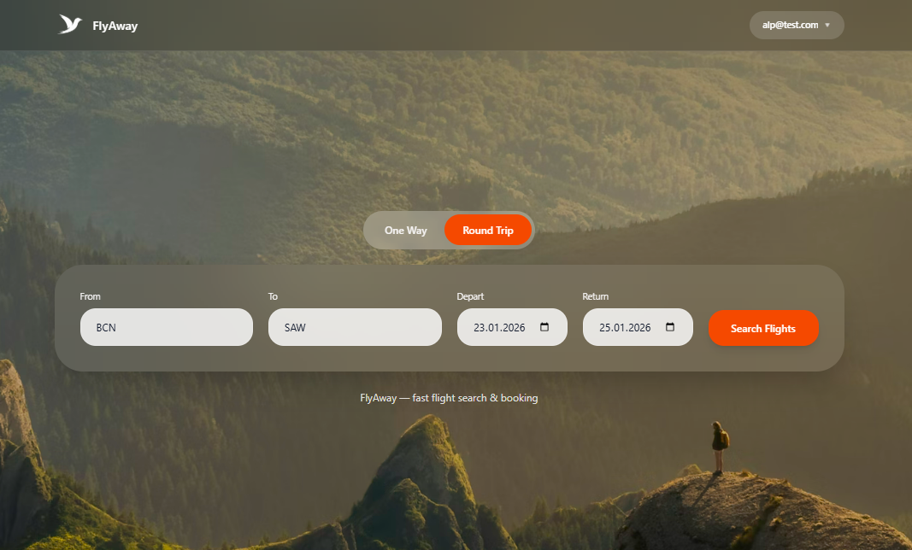

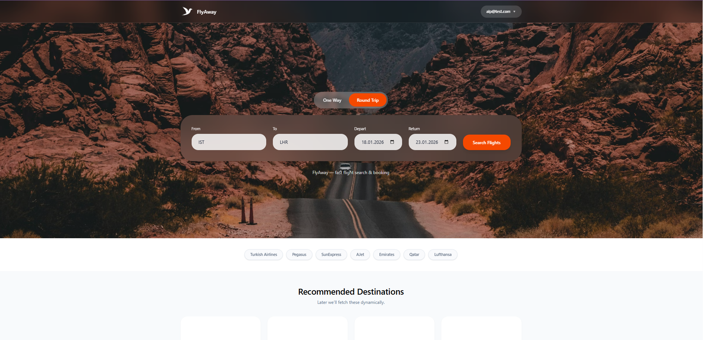

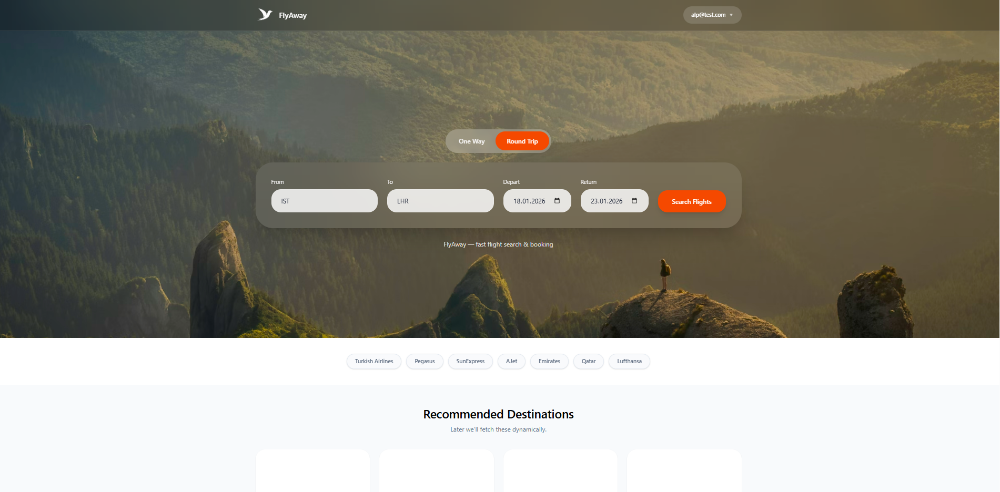

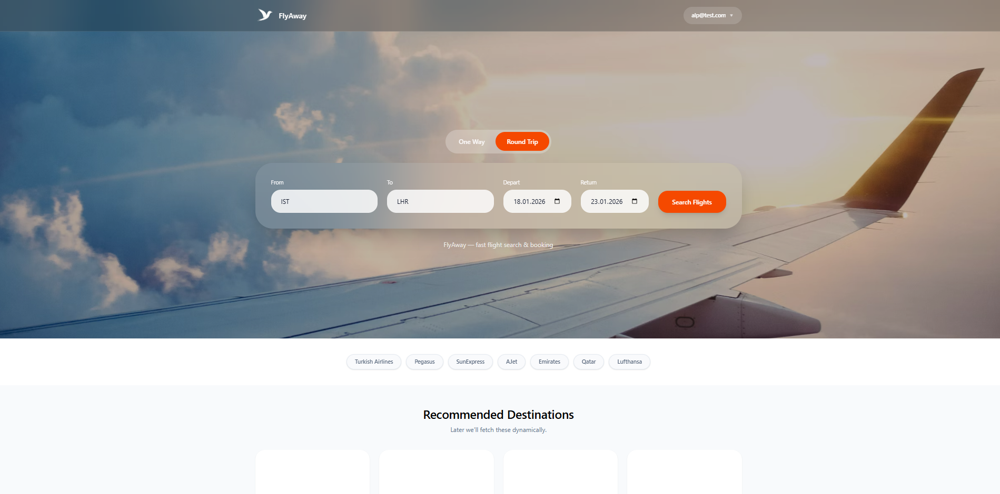

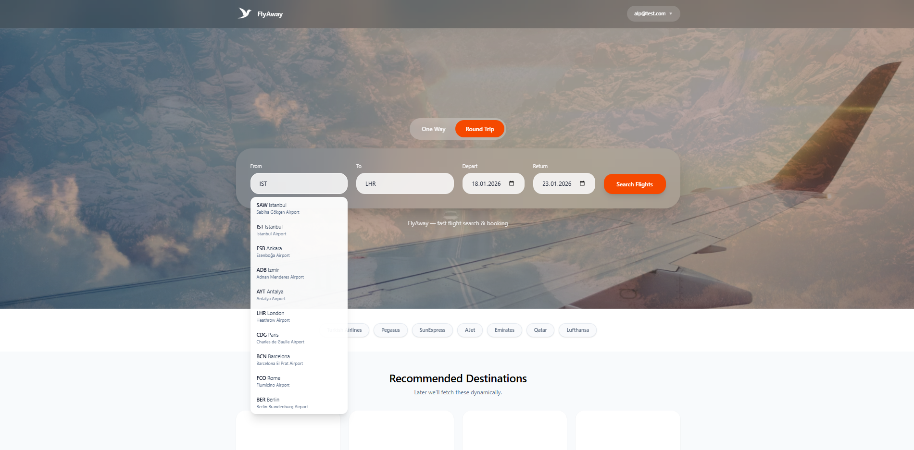

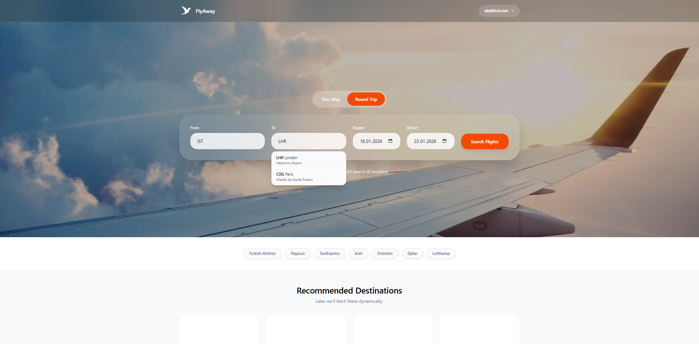

### Flight Selection Page
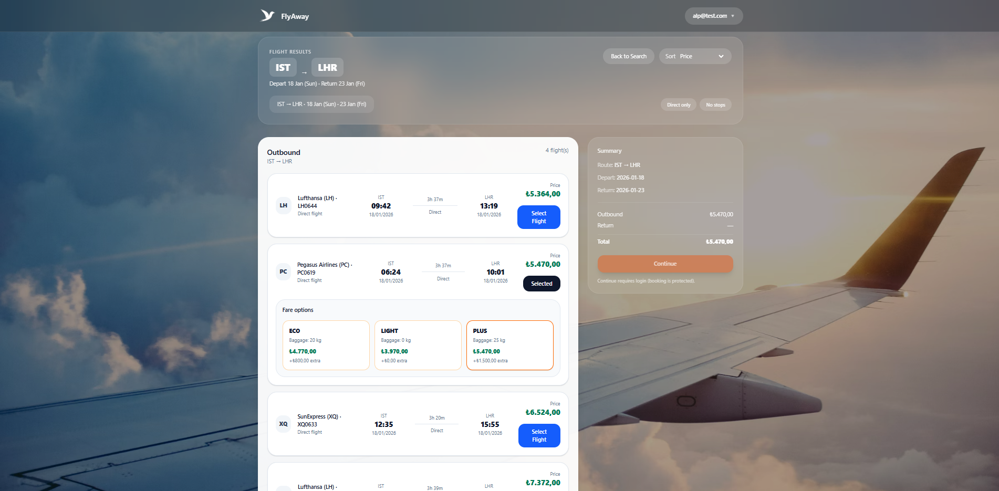

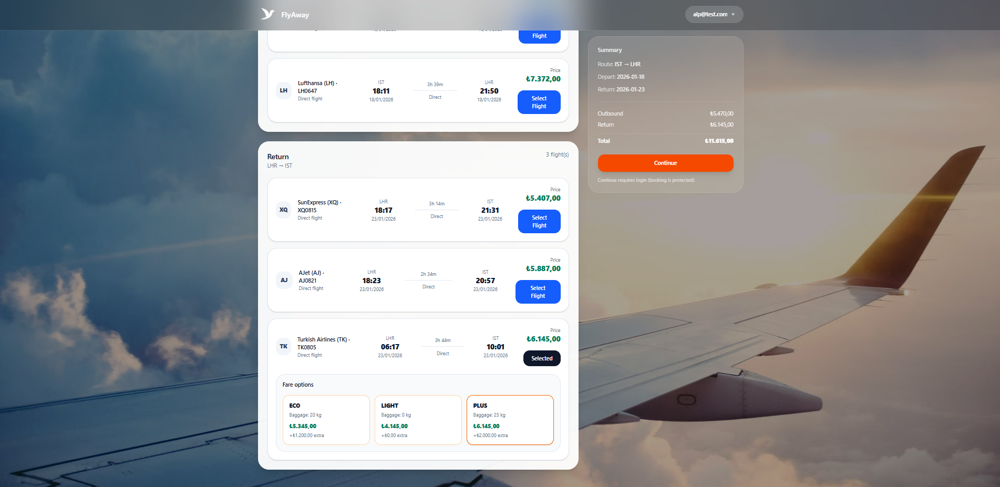

### Ancillaries Flow
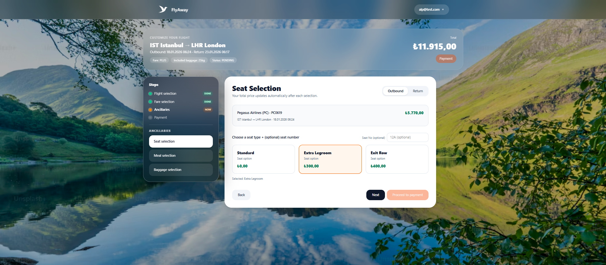

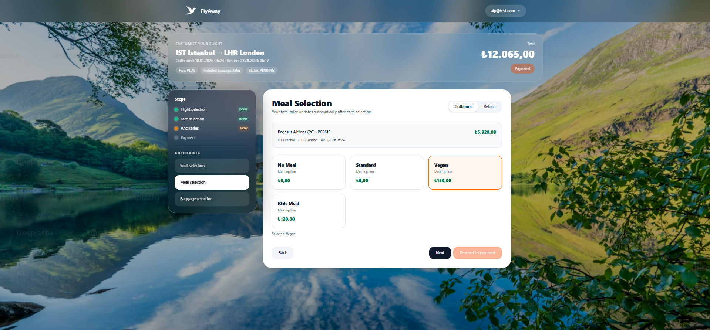

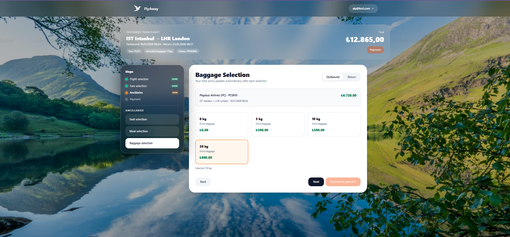

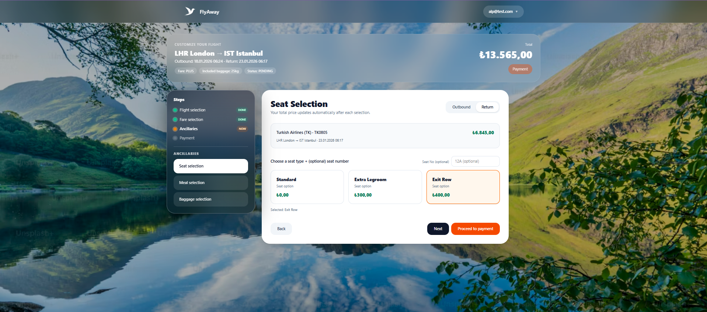

### Payment Flow
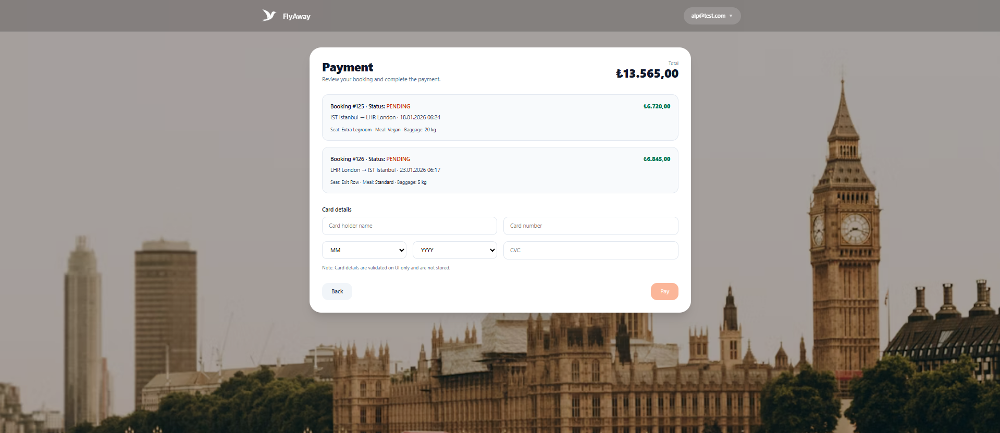

